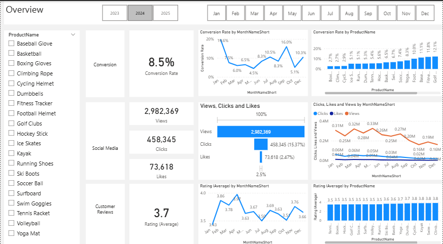
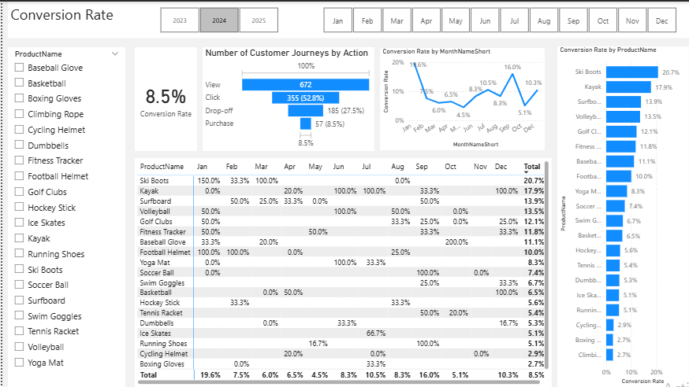
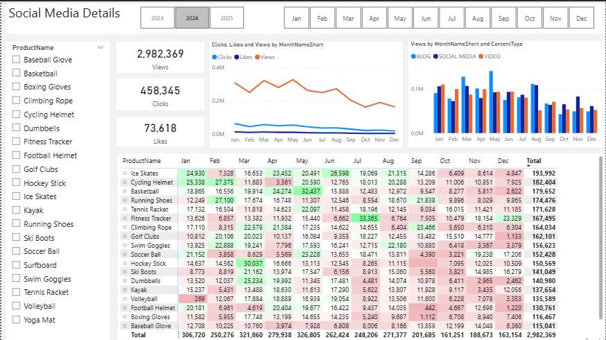
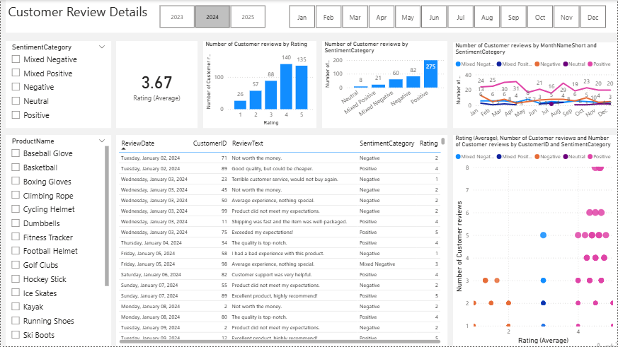

# E-Commerce Growth Intelligence Project

## Overview
End-to-end data analytics project analyzing customer behavior, product performance, 
and marketing engagement using SQL, Python, and Power BI.

## Business Problem in detail
ShopEasy is an online retail business used as the basis for this analytics case study.
ShopEasy is facing reduced customer engagement and conversion rates despite launching several new online marketing campaigns.

Key Points:
Reduced Customer Engagement: The number of customer interactions and engagement with the site and marketing content has declined.
Decreased Conversion Rates: Fewer site visitors are converting into paying customers.
High Marketing Expenses: Significant investments in marketing campaigns are not yielding expected returns.
Customer Feedback Gap: No systematic analysis exists to identify recurring themes in reviews, making it impossible to act on customer sentiment at scale.

## Dataset
The `e-commerce_growth_intelligence_dump.sql` file recreates the full `portfolioproject_marketinganalytics` database with 6 tables:

| Table | Description |
|-------|-------------|
| `customers` | Customer demographics (ID, name, email, gender, age, geography FK) |
| `geography` | Country and city lookup table |
| `products` | Product catalog with pricing |
| `customer_reviews` | 1,363 raw review records with star ratings and review text |
| `engagement_data` | Social media, blog, and video content engagement metrics |
| `customer_journey` | Funnel stage tracking per customer-product pair |

## Tech Stack
- **Database:** MySQL Workbench
- **Analysis:** MySQL (joins, aggregations, CTEs, window functions)
- **Sentiment Analysis:** Python, NLTK VADER
- **Visualization:** Power BI Desktop (4 dashboard pages)

## Project Architecture
MySQL Workbench → SQL Analysis → Python (NLTK VADER) → CSV → Power BI Dashboard

## Key Analysis Performed
- Customer journey funnel analysis
- Product performance by rating and revenue
- Sentiment scoring of customer reviews (compound score + bucketing)
- Marketing content effectiveness

## Dashboard Preview
### Overview


### Conversion Rate


### Social Media Details


### Customer Review Details


## Key Insights

### Insight 1: Conversion funnel has concentrated drop-off at specific stages
The data shows conversion is not uniformly weak across all products. Kayaks, Ski Boots, and Baseball Gloves outperform other categories, and January and September show peak conversion windows. This means the drop-off problem is concentrated in specific product categories and off-peak months, not a blanket issue across the entire funnel. The opportunity is targeted, not a complete funnel overhaul.

### Insight 2: Engagement is declining and content format is the root cause
Interaction rates are low and trending downward from September through December. The pattern across social media and blog content suggests the problem is not reach but content quality and call-to-action effectiveness. Passive content formats are not driving action. The channel mix is less of a problem than what is being published within those channels.

### Insight 3: Customer sentiment is polarized, not uniformly negative
Reviews are not mostly bad, they are mixed. A segment of customers is leaving negative or mixed feedback that is pulling the average below the 4.0 target. This is actually a recoverable situation because mixed reviewers are not fully dissatisfied, they are on the fence. A direct follow-up strategy targeting this segment specifically has a realistic chance of moving ratings upward without requiring product changes.


## Files
| File | Description |
|------|-------------|
| `sentiment_analysis.py` | VADER sentiment scoring + categorization |
| `fact_customer_reviews_with_sentiment.csv` | Sentiment output data |
| `sql/analysis_queries.sql` | All MySQL analysis queries |
| `dashboard/e-commerce_growth_intelligence.pbix` | Power BI dashboard file |
| `logs/sentiment_analysis.log` | Pipeline run logs (auto-generated at runtime, excluded from repo via .gitignore) |


## How to Run

### 1. Set Up the Database
Import the MySQL dump file to recreate the database and all 6 tables locally:
```bash
mysql -u root -p < data/e-commerce_growth_intelligence_dump.sql
```
This will create the `portfolioproject_marketinganalytics` database with all tables populated.

### 2. Run SQL Queries
Open sql/analysis_queries.sql and run all the queries one by one in MySQL Workbench

### 3. Configure Environment Variables
Rename `.env.example` to `.env` and fill in your MySQL credentials:
```
DB_HOST=localhost
DB_USER=your_mysql_username
DB_PASSWORD=your_mysql_password
DB_NAME=portfolioproject_marketinganalytics
```

### 4. Install Python Dependencies
```bash
pip install -r requirements.txt
```

### 5. Run Sentiment Analysis
```bash
python sentiment_analysis.py
```
This generates `fact_customer_reviews_with_sentiment.csv` in the project root.
Also logs will populate automatically in sentiment_analysis.log file inside logs folder.

### 6. Open the Dashboard
Open `dashboard/e-commerce_growth_intelligence.pbix` in Power BI Desktop.
The CSV output from Step 5 is already included in the repo if you want to skip straight to the dashboard.